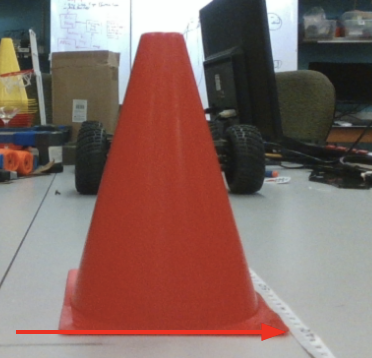
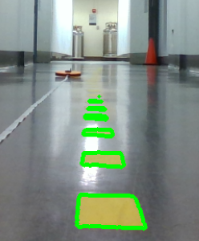

[](https://classroom.github.com/a/ohaLQg1Z)
# Lab 8: Vision Lab

Welcome to the Vision Lab. There are four parts in this lab. Part 1-3 are quite straightforward, whileas the last part is a bit involved. Please work in teams to complete this lab and make good use of Google. A lot of people have implemented this. If you have some problem, it's highly likely answered on some developer community.

## I. Learning Goals

- Use of v4l2 to access and control camera device.
- Camera calibration with OpenCV
- Distance measurement with object on the ground
- Training and Deployment of an object detection with TensorRT

## II. Use cameras on Linux system

As we have discussed in the lecture, in Linux cameras are mounted as file systems. Connect the Realsense camera you have received to Jetson and check if you can see three outputs with the `ls /dev/video*` command. Use OpenCV to capture RGB frames from `/dev/video2`.

During racing, we want to receive camera frames as fast as possible. Realsense camera only operates at 60Hz with a 960x540 resolution. Please modify your code so that we have receiving 960x540 images at 60Hz.

<!-- Then write a ROS2 node that captures RGB frame from the Realsense camera and publish it onto `/rgb_img` channel using `sensor_msgs/Image` message type. -->

Save this part of the code as 'camera.py' or 'camera.cpp'.

## III. Camera Calibration & Distance Measurement

In this part, you will develop a distance measurement algorithm with the assumption that the camera frame axes are overlapping the car frame axes with a height H on the Z axis of car frame.

First, we need to get the camera intrinsic matrix from a camera calibration. The images needed for such a calibration is provides in the 'calibration' folder. Please use `findChessboardCorners` and `calibrateCamera` to get the intrinsic matrix. The calibrations checkerboard is 6x8 and side witdth is 25cm.

Second, the height of the camera can be difficult to measure precisely. We need corresponding point in the car frame to calculate this height. In the `resource` folder, there is an image with measured x_car distance called `cone_x40cm.png`. The x_car of the cone is 40cm. Please calculate the mounting height with this info.

Please write a function that takes in image pixel coordinates and outputs the distance in x_car and y_car coordinate. There is another image with unknown distance called `cone_unknown.png` in the `resource` folder. Please the distances from the camera to this cone. 

Note 1: All distances are with respect to the lower right corner of the nearest red cone.


Note 2: x, y coordinates are different from row and column in an image.

Note 3: All images are in 960x540 resolution.

<!--  -->

Save this part of the code as 'distance.py' or 'distance.cpp'.

## IV. Lane Detection

In this part, you will develop a lane detection algorithm with classical computer vision. In the 'resource' folder, there is one image with yellow lane marks. Your task is to detect the lane maskers as good as possible, using HSV color space, `findContours` or any other functions. The example with lawn detection in the lecture is a path to follow. 

Your final result should look like this:


Please write a function that take in an image and draw green edges around or green overlaps on the marks you detect.

Save this part of the code as 'lane.py' or 'lane.cpp'.

## V. Object Detection Network Training & Deployment

In this part, you will first train an object detection nerual network and deploy it onto the F110 car. 

### Nerual Network Training

#### Upload to Google Colab

For the network training, we provide labeled dataset and a simple YOLO training and testing notebook written in Pytorch. You can access them [here](https://drive.google.com/drive/folders/18gjExE2XiQBj1f0_pgRPvbCSnguI6cLS?usp=sharing). You can use it to train on Google Colab with the free GPU resource. If you are new to Pytorch, watch this [tutorial](https://www.youtube.com/watch?v=Jy4wM2X21u0) as it goes through some key components in a training pipeline.

You can create an ese_615 folder in the 'My Drive' in your Google Drive. Upload the notebook and unzipped dataset folder. Open the note book with Google Colab and make sure you are connected to a GPU instance. The notebook has everything you need to for training and testing. For some of post-processing functions, you can just borrow them when you do you deployment.

#### TODOs

There are only a few positions where marked 'TODO'. First is the network layer channels. Play around with different channel configurations. The first input channel should be 3, because we are feeding it with RGB image. The final output layers should be 5, because we have x, y, w, h and confidence. We don't have class, because we are only detecting F110 cars. Make sure the output channel of the upper layer needs to match the batchnorm size and the input channel of the lower layer. Usually the channels are set as multiplies of 2.

The next 'TODO' are some hyperparameters: batchsize, learning rate and epoch. Large batchsizes make you learn faster, but lower batchsizes give more randomness. Large learning rate make you learn faster but may be unstable (producing NaNs) and bounce around the optimal point. Epoch is just how many times you run with all the dataset. Play around with this values and get a sense of what's suitable. Since our detection task is simple and the dataset is not diverse. You should be able to drop the training error below 1000 quite easily and you won't need to pay for a fast GPU to complete this lab. We are not grading on the accuracy, as long as it can detect somewhat.

#### Use Other Networks

If you are familiar with network training, you can choose any network architecture you like and train it with our dataset. You can receive great **extra credit** if you train a better object detection NN that is more robust. You need to make sure that it can be successfully deployed with TensorRT 8.5, which is the latest version you can get for Jetson. List your name in the `submission.md` if you did this.

### TensorRT Deployment

After you are done with training the network, convert it into a TensorRT engine on the Jetson NX. To do this, first convert the model from PyTorch into ONNX and then to TensorRT. Then write a function that takes in an image, preprocess it, run with the model, post-process and return the results. Refer to the sample [code](https://github.com/NVIDIA/TensorRT/tree/release/8.4/samples) provided by TensorRT for building the engine. Make sure you select the correct branch for your TensorRT version. Some other references are attached at the end. **Notice they may be for a previous version.**

Save this part of the code as 'convert_trt.py' or 'convert_trt.cpp' and 'detection.py' or 'detection.cpp'.

#### Install Pytorch
If your Jetson doesn't have Pytorch, follow [this](https://docs.nvidia.com/deeplearning/frameworks/install-pytorch-jetson-platform/index.html) to install Pytorch.

#### Install ONNX and matplotlib
```
sudo apt-get install python3-matplotlib
sudo apt-get install python3-pip libprotoc-dev protobuf-compiler
pip3 install onnx
```

#### Install pycuda and set up TensorRT
If your Jetson doesn't have pycuda, follow [this](https://docs.donkeycar.com/guide/robot_sbc/tensorrt_jetson_nano/) to set up TensorRT and install pycuda. (Only do Step 2)

#### Implementation Tips

1. In your deployment order, do not import Pytorch. Use numpy to reshape the output to (5, 5, 10) if you use my code.

2. Convert the the engine using FP32 and FP16 mode and compare the speed difference. See `submission.md`.
 
## VI. Combining the Functions

In the final part, write a complete package that takes image from the camera, run the lane detection and object detection on the image, then use the center point of the botton bounding box edge from object detection to calcuate the distance to the object. Please note that the image resolution should be 960x540 and your detection resolution may be smaller.

Save this part of the code as 'integrated.py' or 'integrated.cpp'.

<!-- In the final part, we will write another ROS node that subscribes to `/rgb_img` channel for an image. Run the lane detection and object detection on the image. Then use the center point of the botton bounding box edge from object detection to calcuate the distance to the object. Please note that the image resolution should be 960x540 and your detection resolution is smaller. -->

<!-- Publish the result image with lane detection and object detection indicators to the `/det_img` channel. Publish the distance to detections to the `/det_distance` channel. -->

## VII. Deliverables and Submission

Push your finished code onto github repo. Make you name the parts as instructed.

Please follow the `submission.md` in the Github repo.

## VIII: Grading Rubric

- Accessing Image: **10** Points
- Distance Measurement: **15** Points
- Lane Detection: **20** Points
- Network Training: **15** Points
- TensorRT Deployment: **30** Points
- Integration: **10** Points

## Other References
1. [tutorial](https://learnopencv.com/how-to-convert-a-model-from-pytorch-to-tensorrt-and-speed-up-inference/)
2. [guide](https://docs.nvidia.com/deeplearning/tensorrt/sample-support-guide/index.html)
3. You can see [this](https://github.com/NVIDIA-AI-IOT/torch2trt/issues/233) on how to save and read engine file. Also, due to version difference, we need to replace this [line](https://github.com/spmallick/learnopencv/blob/a18fa4e1a255f58700b3c4687e425cabd58c41bf/PyTorch-ONNX-TensorRT/trt_inference.py#L17) by the following two lines.
```
explicit_batch = 1 << (int)(trt.NetworkDefinitionCreationFlag.EXPLICIT_BATCH)
network = builder.create_network(explicit_batch)
```
